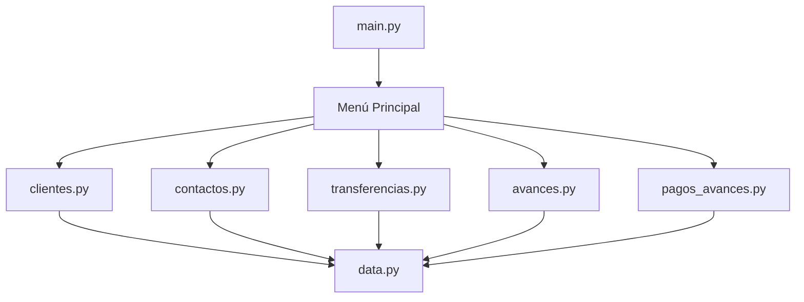

# 🏦 Sistema Bancario INACAPINO

<div align="center">


**Sistema bancario educativo desarrollado en Python con interfaz de consola enriquecida gracias a la librería `Rich`.**

</div>

---

## 📋 Descripción del Proyecto

El **Sistema Bancario INACAPINO** es una aplicación de consola segura y modular que simula las funciones clave de una banca digital. Está diseñado para mostrar buenas prácticas en programación estructurada, manejo de listas, validaciones, control de errores y experiencia de usuario en terminal.

---

## ✨ Características Destacadas

- ✅ **Validación robusta de RUN chileno**
- 👤 **Gestión completa de clientes y cuentas**
- 🔒 **Seguridad en transferencias solo entre contactos**
- 💳 **Avances con tarjeta de crédito con interés y cuotas**
- 💸 **Pagos de cuotas con desglose de capital abonado y adeudado**
- 📱 **Interfaz moderna y colorida con [Rich](https://github.com/Textualize/rich)**
- ⚠️ **Manejo de excepciones, saldos insuficientes y límites de crédito**

---

## 🏠 Estructura del Proyecto

```bash
📆 banco-inacapino/
🔝 main.py               # Menú principal e interacción del usuario
🔝 data.py               # Listas globales (simulación de base de datos)
🔝 utils.py              # Validaciones, entradas y limpieza de pantalla
🔝 clientes.py           # Registro y listado de clientes
🔝 contactos.py          # Registro y listado de contactos
🔝 transferencias.py     # Transferencias seguras entre cuentas
🔝 avances.py            # Solicitud de avances con tarjeta de crédito
🔝 pagos_avances.py      # Pago de cuotas de avances
🔝 README.md             # Documentación del proyecto
```

---

## ↺ Flujo General del Sistema



---

## 📦 Instalación y Uso

### 📅 1. Clonar el repositorio

```bash
git clone https://github.com/tu-usuario/banco-inacapino.git
cd banco-inacapino
```

### 📦 2. Instalar dependencias

```bash
# Instalar la única librería externa necesaria
pip install rich
```

### 🏁 3. Ejecutar el sistema

```bash
python main.py
```

---

## 🚀 Guía Rápida de Uso

1. 📟 **Registrar Cliente**  
   Desde el menú principal, selecciona la opción `[1]` e ingresa:
   - Nombre
   - Apellido
   - RUN chileno válido (ej: `12.345.678-9`)
   - Monto de depósito inicial

2. 🢑 **Agregar Contactos**  
   Opción `[3]` para registrar contactos a los que podrás transferir dinero.

3. 💸 **Solicitar Avance**  
   Usa la opción `[6]` para solicitar un avance con tarjeta en cuotas.

4. 📆 **Pagar Cuotas**  
   Selecciona `[7]` para pagar las cuotas pendientes del avance con desglose de capital.

5. ⟳ **Transferir Dinero**  
   Solo a contactos registrados (opción `[5]`).

---

## ✅ Requisitos

- Python 3.8 o superior
- Sistema operativo con consola compatible
- Conexión a Internet (solo para clonar el repo o instalar `rich`)

---

## 📜 Licencia

Distribuido bajo la Licencia MIT. Ver [`LICENSE`](LICENSE) para más información.

---

## 🤝 Atribuciones

Proyecto desarrollado para fines académicos bajo el marco de la asignatura *Introducción a la Programación Segura - INACAP*.

---
